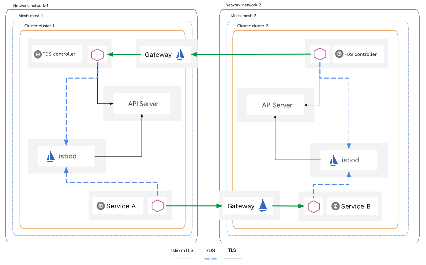

# Federation

This project implements Istio mesh federation using a Kubernetes controller that provides an API
for managing multi-mesh communication, implements service discovery and automates the management of Istio configuration.

Mesh federation enables secure communication between applications across mesh boundaries using mTLS.
Each mesh can federate a subset of its services, allowing applications from other meshes to connect securely.
With end-to-end mTLS authorization can be handled directly by the federated application.

## Multi-primary vs federation

[Multi-primary](https://istio.io/latest/docs/setup/install/multicluster/multi-primary_multi-network/) and
[primary-remote](https://istio.io/latest/docs/setup/install/multicluster/primary-remote_multi-network/) topologies
are great solutions for expanding single mesh to multiple k8s clusters, giving better system resiliency and higher availability.
However, they do not fit well in the following cases:

1. Decentralized control and ownership of clusters.

    **Use case**: Different teams or departments manage their own clusters and control planes independently.

    **Reason**: Federation allows each team to maintain autonomy over their cluster’s Istio configurations while still enabling
    selective cross-mesh communication.

1. Simplified networking between clusters.

    **Use case**: Clusters communicate over public networks without a shared private network (e.g., VPC peering).

    **Reason**: Federation and multi-primary both use gateway-based communication for data-plane traffic.
    Multi-primary deployments, however, require control planes to access remote kube-apiservers.
    This often requires extra network configuration, as users typically do not want to expose kube-apiservers to the internet.

## High-level architecture

## How it works

### Service discovery

#### Import

Controllers connect to each other using gRPC protocol and subscribe to `FederatedService` API.
When a controller receives an update, it creates `ServiceEntry` or `WorkloadEntry` depending on the local cluster state.
It also applies client-side configurations using `DestinationRule` if the mesh federation requires customizing SNI for cross-cluster traffic.

#### Export

Controllers connect to the local kube-apiserver to discover local services matching export rules.
When a controller receives an update from Kubernetes about a `Service` matching export rules,
it is exposed on a federation ingress gateway. The federation ingress gateway is very similar to the east-west gateway
in multi-primary and primary-remote deployments, but it exposes only one TLS auto-passthrough port.

### Security

The federation controller is deployed within each federated mesh with a sidecar like any other application.
Each controller creates `PeerAuthentication` to enable strict mTLS for itself and configures proper `AuthorizationPolicy`
to allow traffic only from the configured remote controllers.

Controllers **DO NOT** enforce any authorization policy at the mesh boundaries to avoid mTLS termination between applications.
Application or cluster admins are responsible for configuring their authz policies, and it is highly recommended
to deny all traffic by default and allow only selected services.

## Identity and trust model

This controller does not provide any mechanism to share trust bundles between meshes using different CAs.
It can only enable mTLS communication between meshes when all clusters use the same root CA or use SPIRE
with enabled trust bundle federation.

## Getting started

Follow these guides to see how it works in practice:
1. [Simple multi-mesh bookinfo deployment](examples/README.md).
2. [Integration with SPIRE](examples/spire/README.md).
