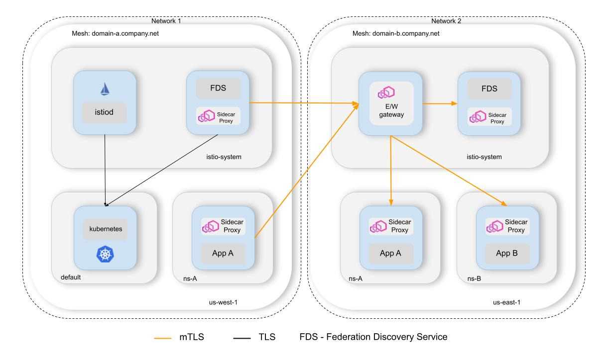

# Federation

This project implements Istio mesh federation using a Kubernetes controller that provides an API
for managing multi-mesh communication, implements service discovery and automates the management of Istio configuration.

Mesh federation enables mTLS communication between applications across mesh boundaries.
Each mesh can federate a subset of its services to allow applications from other meshes to connect to these services.

Federated services are exposed on a passthrough gateway, so mTLS is not terminated at the edge of the cluster,
and authorization can be performed by the federated application.

## Multi-primary vs federation

[Multi-primary](https://istio.io/latest/docs/setup/install/multicluster/multi-primary_multi-network/) and
[primary-remote](https://istio.io/latest/docs/setup/install/multicluster/primary-remote_multi-network/) topologies
are great solutions for expanding single mesh to multiple k8s clusters for better system resiliency and higher availability.
However, these solutions do not fit well in the following cases:

1. Decentralized control and ownership of clusters.

    **Use case**: Different teams or departments manage their own clusters and control planes independently.

    **Reason**: Federation allows each team to maintain autonomy over their cluster’s Istio configurations while still enabling
    selective cross-mesh communication.

1. Simplified networking between clusters.

    **Use case**: Clusters communicate over public networks without a shared private network (e.g., VPC peering).

    **Reason**: Both federation and multi-primary rely on gateway-based communication for the data-plane traffic,
    but in multi-primary deployment control planes need access to remote kube-apiservers and that usually requires
    additional network configuration for secure access, as most users do not want to expose kube-apiserver to the internet.

1. Limited service sharing.

    **Use case**: Only a subset of services needs to be shared across clusters (e.g., common APIs or external-facing services).

    **Reason**: Federation allows you to expose and consume specific services across meshes using service entries, 
    without fully integrating the control planes. This is partially possible in multi-primary deployment, 
    but exporting services could be limited only to namespaces matching configured discovery selectors.

1. Operational simplicity for isolated meshes.

   **Use case**: You want to simplify troubleshooting and upgrades by isolating cluster-specific issues.

   **Reason**: Since federated meshes don’t rely on a shared control plane, issues are localized to individual clusters.

## High-level architecture

## How it works

### Service discovery

#### Import

Controllers connect to each other using gRPC protocol and subscribe to `FederatedService` API.
When a controller receives an update, it creates `ServiceEntry` or `WorkloadEntry` depending on the local cluster state.
It also applies client-side configurations using `DestinationRule` if the mesh federation requires customizing SNI for cross-cluster traffic.

#### Export

Controllers connect to the local kube-apiserver to discover local services matching export rules.
When a controller receives an update from Kubernetes about a `Service` matching export rules,
it is exposed on a federation ingress gateway. The federation ingress gateway is very similar to the east-west gateway
in multi-primary and primary-remote deployments, but it exposes only one TLS auto-passthrough port.

### Security

The federation controller is deployed within each federated mesh with a sidecar like any other application.
Each controller creates `PeerAuthentication` to enable strict mTLS for itself and configures proper `AuthorizationPolicy`
to allow traffic only from the configured remote controllers.

Controllers DO NOT enforce any authz policy at the mesh boundaries to avoid mTLS termination between applications.
Application or cluster admins are responsible for configuring their authz policies, and it is highly recommended
to deny all traffic by default and allow only selected services.

## Identity and trust model

This controller does not provide any mechanism to share trust bundles between meshes using different CAs.
It can only enable mTLS communication between meshes when all clusters use the same root CA or use SPIRE
with enabled trust bundle federation.

## Getting started

Follow these guides to see how it works in practice:
1. [Simple multi-mesh bookinfo deployment](examples/README.md).
2. [Integration with SPIRE](examples/spire/README.md).

## Comparing to other projects

#### Admiral

[Admiral](https://github.com/istio-ecosystem/admiral) is primarily designed to manage multi-cluster service discovery
and traffic distribution in Istio, focusing on use cases where clusters are part of a single logical mesh,
such as multi-primary or primary-remote topologies, so it does not seem like a right place to implement multi-mesh APIs.

#### Emcee

[Emcee](https://github.com/istio-ecosystem/emcee) was a PoC of multi-mesh deployment, but that project has been inactive for 5 years,
and there is no clear value in contributing our ideas, because that would require to change all APIs and general assumptions for that project,
so it's easier to start from scratch.
